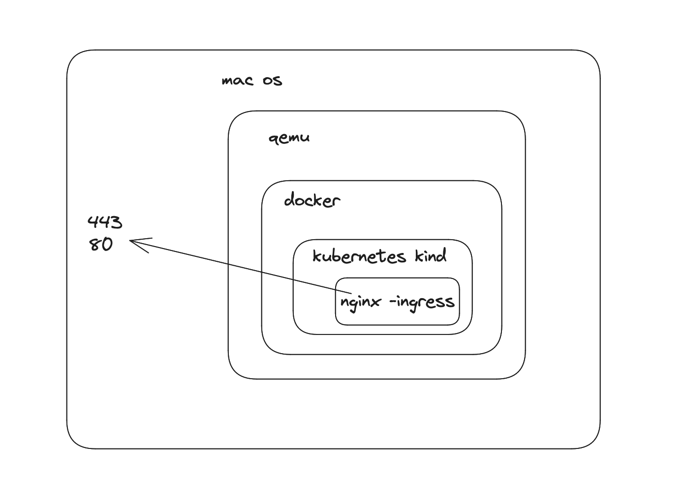

# kind x strimzi

Sample project of kafka cluster deployed with strimzi on kind kubernetes cluster

setup kind kubernetes cluster

```shell
$ make cluster
```

setup nginx ingress controller

```shell
$ make ingress
```

setup strimzi operator

```shell
$ make strimzi
```

create kafka cluster

```shell
$ make kafka
```

Test command

```shell
$ make test-internal # port-forward internal broker listener
$ make test-services # port-forward exposed broker listener through service
$ make test-ingress # port-forward ingress controller service
$ make test # direct access with kind port-mapping
```

delete kubernetes cluster and everything contained

```shell
$ make delete
```

---

doc:

architecture layer


